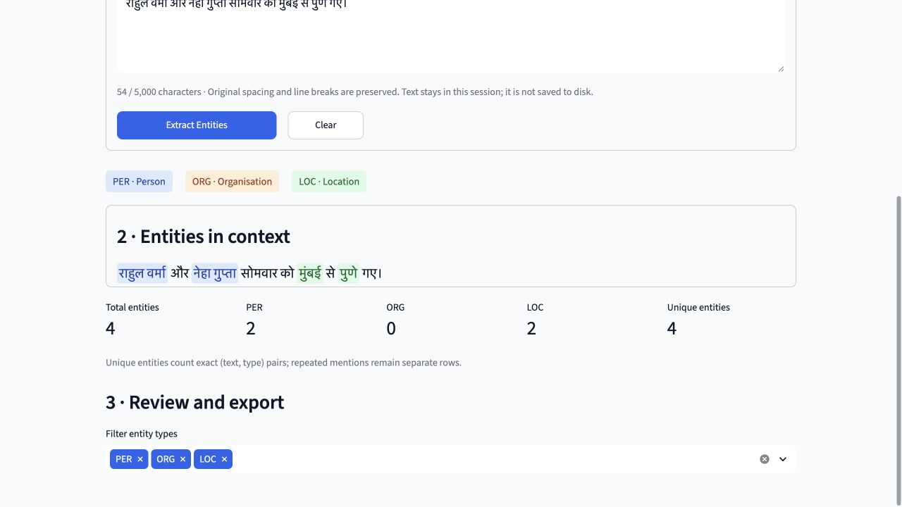

# IndicNewsNER Project Report

Fourth year undergraduate NLP project | 21 September 2026

## Project overview

IndicNewsNER has completed a reproducible Hindi named entity recognition pipeline, a frozen classical Conditional Random Field baseline, and a local demonstration application. The selected model was trained on 100,000 clean Naamapadam records and achieved strict entity micro F1 of 0.745064 on the 506-record clean test split. The current application extracts people, organisations and locations from Hindi text and exports the detected spans.

The broader project concerns multilingual named entity recognition for Indian news. Work completed so far is limited to Hindi and a classical CRF. English integration, neural models and independently verified current-news performance remain future work.

### Problem and objectives

News readers and downstream applications need to identify who is mentioned, which organisations are involved and where events occur. Hindi text introduces Unicode, morphology and token-boundary challenges. This project establishes a transparent baseline before more complex models are considered.

The completed objectives are to audit and preserve source data, build reproducible clean splits, train memory-bounded CRF experiments, select using validation evidence, freeze the selected artifacts, evaluate once on held-out data, and demonstrate exact entity spans in an explainable interface.

### Current completion status

| Work area | Status |
| --- | --- |
| Data acquisition and audit | Completed with provenance and checksums |
| Cleaning and reproducibility | Completed with removal and repair records |
| CRF scaling experiments | 1k, 10k, 50k and 100k completed |
| Milestone 2C freeze and evaluation | Completed; 100k baseline frozen |
| Milestone 2D demonstration | Implemented and running locally |
| Neural and multilingual extension | Not started |

Current verification: 85 tests passed, with zero failures, skips or errors. The full freeze manifest verified all 51 covered files on 21 September 2026. No new final test evaluation was performed for this report.

## Data and preparation

The Hindi subset of ai4bharat/naamapadam is pinned to source revision 9d4f21ac57d11ed4f9ea64854fdc9f5618e61acc. Records contain token sequences and BIO entity labels. The seven labels are O, B-PER, I-PER, B-ORG, I-ORG, B-LOC and I-LOC. The derived dataset is named naamapadam_hi_crf_v1.

| Split | Raw records | Clean records | Clean tokens |
| --- | --- | --- | --- |
| Training | 985,787 | 963,174 | 21,483,205 |
| Validation | 13,460 | 12,896 | 289,695 |
| Test | 867 | 506 | 12,388 |

The original source contains 1,000,114 records and 22,353,583 tokens. A separate official_test retains all 867 records and 19,893 tokens with the original annotation semantics. Three empty test records are quarantined from the clean split.

### Cleaning policy

Preparation preserves original token text. For overlap detection, each token is normalized to NFC, tokens are joined with spaces and whitespace is collapsed; case is preserved. Invalid BIO sequences are repaired in the derived data before filtering. Empty test records are quarantined, later splits are checked against earlier clean splits, and exact token-and-label duplicates retain the lowest source index.

The audit recorded 5,589 type-mismatch repairs and five orphan-I repairs, giving 5,594 repairs before removals. It removed 22,619 exact duplicate records and 916 leakage records, and quarantined three empty records. These operations are accounted for separately in the manifests.

The test-overlap audit identified 16 records overlapping clean training and 341 overlapping clean validation, with no record in both groups. This materially reduces the independent clean test set and explains why the original official test is retained only as a separately qualified comparison.

### Reproducibility and provenance

Raw and derived artifacts use SHA256 checksums. Explicit source indices, repair records and removal manifests allow the preparation to be reconstructed. Repeated streaming reconstruction produced byte-identical clean files. Dataset integrity checks verify token-label alignment, valid labels, source accounting and split invariants.

Upstream license declarations conflict: the dataset Hub metadata and loader identify different licenses. The project records this uncertainty and does not assume unrestricted redistribution. The dataset is multi-domain; its use does not by itself establish a current Indian-news benchmark.

## Classical CRF methodology

A linear-chain CRF predicts a sequence of labels jointly, combining evidence about each token with transitions between neighbouring labels. This makes it a useful interpretable baseline for BIO tagging: local token features and sequence consistency both contribute to the output.

### Feature design and training

Features include the original Unicode token, length, prefixes and suffixes of one to three characters, numeric and punctuation indicators, script indicators, Unicode categories and word shape. A one-token context window supplies neighbouring features, with beginning and end markers. Lowercase variants are restricted to Latin text. No gazetteers, transliteration or test-derived feature lists are used.

CRFsuite training uses L-BFGS, c1 = 0.1, c2 = 0.1, at most 100 iterations and all possible transitions. Training samples are nested and deterministic with seed 42. Entity-coverage anchors and a seed/index hash ordering select records exclusively from train_clean. Source indices are saved for reconstruction.

| Records | Val micro F1 | Val macro F1 | Train seconds | Peak RSS GiB |
| --- | --- | --- | --- | --- |
| 1,000 | 0.518881 | 0.515804 | 3.83 | 0.109 |
| 10,000 | 0.638999 | 0.635749 | 39.68 | 0.419 |
| 50,000 | 0.695146 | 0.690853 | 199.76 | 1.488 |
| 100,000 | 0.713770 | 0.709317 | 368.14 | 2.658 |

Validation micro F1 rose from 0.518881 at 1k to 0.713770 at 100k. The final increase from 50k to 100k was about 1.86 percentage points. The 100k model was retained using validation results and manageable observed memory use before any final test scores were available.

The 100k sample contains 2,234,979 tokens. Feature extraction took 36.26 seconds and training 368.14 seconds. A separate monitor bounded training against available memory. Measurements are from the local macOS ARM environment and are not hardware-independent performance guarantees.

### Frozen baseline identity

Experiment: crf_100k_seed42_24dd05e84a26. The native model is 22,707,636 bytes, approximately 21.66 MiB. The freeze covers the model, resolved configuration, sample, environment, data, label schema and source/evaluation files. The original pinned package versions remain unchanged; the demo adds its own dependency list.

Model SHA256: 80395321d26b43076c01cdbea5d3d729159ef3581ca9fdec1214d3cec92cac5c

## Final evaluation and interpretation

The main measure is strict entity F1: a prediction is correct only when its boundaries and entity type match exactly. Precision measures the fraction of predicted entities that are correct; recall measures the fraction of gold entities recovered. Micro F1 pools entity counts, while macro F1 averages PER, ORG and LOC scores. Only B tags start spans under the strict evaluator; invalid I tags do not create a new span.

| Evaluation split | Records | Precision | Recall | Micro F1 | Macro F1 |
| --- | --- | --- | --- | --- | --- |
| Validation clean | 12,896 | 0.740148 | 0.689207 | 0.713770 | 0.709317 |
| Test clean | 506 | 0.762803 | 0.728130 | 0.745064 | 0.732890 |
| Official test | 867 | 0.787713 | 0.747138 | 0.766889 | 0.759028 |

The clean-test score of 74.51% is the main test conclusion. The official-test score of 76.69% includes development overlap, three empty records and original invalid BIO transitions. The two test sets overlap and are not independent. Scores under this policy should not be presented as directly comparable to papers using different preprocessing or BIO rules.

| Entity | Clean precision | Clean recall | Clean F1 | Gold spans |
| --- | --- | --- | --- | --- |
| PER | 0.803468 | 0.762340 | 0.782364 | 547 |
| ORG | 0.658273 | 0.637631 | 0.647788 | 287 |
| LOC | 0.787975 | 0.750000 | 0.768519 | 332 |

Organisations are the weakest class, consistent with validation performance. Aggregate clean-test analysis records 849 correct entities, 114 boundary errors, 141 missed entities and 100 false-positive entities. These diagnostic categories can overlap and are not a partition of all errors. The counts describe the frozen evaluation and are not used to tune a later model.

### Runtime and evaluation controls

Clean-test feature extraction and tagging took 0.324 seconds in total, with a median of 0.572 ms and a 95th percentile of 1.303 ms per record. Sampled process RSS was 89.38 MiB. These timings exclude model loading, file I/O and scoring; they are not end-to-end application latency. Memory is sampled rather than an exact process high-water mark.

Final inference ran once on each split, clean first and official second, with exclusive markers preventing accidental repeat runs. Replaying saved predictions reproduced the metrics without repeating inference. Later model development must use training and validation only; final predictions and restricted illustrations remain sealed.

## Demonstration application

The local Streamlit application accepts Hindi text and returns coloured entity spans, a count summary, a filterable table and JSON or CSV downloads. PER is blue, ORG orange and LOC green. It always loads the frozen 100k experiment and stops with a clear error if checksum validation fails.

### Inference workflow

Original text → Unicode tokenisation and sentence ranges → frozen feature extraction → CRF BIO tags and marginals → strict entity reconstruction → character offsets → highlighted text and exports.

app.py coordinates the interface. text_preprocessor.py preserves Unicode and token offsets; crf_predictor.py checks the runtime and performs inference; entity_formatter.py reconstructs and escapes spans; exporter.py generates in-memory downloads. The inference path does not require dataset or test-prediction access.

Character and token offsets are zero-based with exclusive ends. Every entity is checked against the original substring. Highlighting uses offsets rather than global replacement, preserving repeated names, punctuation, spacing and line breaks. User HTML is escaped before display, and text is not saved to disk by default.

Confidence is the arithmetic mean of CRFsuite marginal probabilities for the predicted entity-token tags. It is uncalibrated model certainty, not the probability that the entity is correct or a statement is factually true. Input is limited to 5,000 Unicode code points and 300 tokens per sentence.

## Verification and demonstration procedure

The complete test suite passed on 21 September 2026: 85 passed, zero failed, zero skipped and zero errored. Coverage includes checksum failure, deterministic model loading and inference, Unicode tokenisation, empty and overlength input, exact substring recovery, adjacent and repeated entities, invalid BIO transitions, HTML escaping, marginals, export structure and dataset-access guards. The original 66 tests remain intact.

Earlier browser verification covered examples, extraction, highlights, summary, entity table, JSON and CSV download events, input errors and model details. Five real screenshots are saved under docs/demo/screenshots. The server was relaunched for this report at http://127.0.0.1:8501/.

### Original demonstration examples

The built-in examples were authored for the demo and are not copied from the test sets. The saved actual predictions are: person-and-place example — Meera Sharma as PER and Jaipur as LOC; organisation-and-place example — State Bank of India as ORG and Bhopal as LOC; multiple-entity example — Rahul Verma and Neha Gupta as PER, Mumbai and Pune as LOC. The punctuation example detects Anita Rao and Lucknow; the everyday-weather sentence yields no entities. These English glosses describe the Hindi inputs, not English-language model support.

### Run and present

From the project directory, run: .venv/bin/python -m streamlit run app.py --server.address 127.0.0.1 --server.port 8501 --server.headless true --browser.gatherUsageStats false

For a five-minute faculty demonstration, introduce PER, ORG and LOC; select an original Hindi example; extract entities; explain the highlighted spans and exclusive offsets; filter the table; download JSON or CSV; show the offline model metrics; and close with the limitations and future scope. Installation and troubleshooting are documented in docs/demo/CRF_DEMO_GUIDE.md.

### Limitations and future scope

The clean test contains only 506 records. Experiments use a single seed and have no confidence intervals. Dataset annotation ambiguity, remaining domain shift and differing raw-text tokenisation limit generalisation claims. Periods in abbreviations or decimals may introduce extra sentence boundaries. Marginals are not calibrated, and no current-news gold evaluation has been completed.

Future work requires separate approval: develop a BiLSTM-CRF or transformer comparison using train_clean and validation_clean, prepare an independently annotated news-domain evaluation, and design English or multilingual integration. No 250k/full-data CRF, BiLSTM-CRF, IndicBERT or English model has been started. New final evaluations must be explicitly authorised.

## Evidence and reproducibility index

The report consolidates measured project artifacts through Milestone 2D. Paths below are relative to the project root and identify the evidence behind the reported results.

### Dataset audit

reports/data_audit/dataset_summary.json

### Derived data and removal provenance

reports/derived_data/naamapadam_hi_crf_v1_manifest.json

### Experiment comparison

reports/crf/crf_scaling_comparison.csv

### Frozen file identity

reports/crf/100k_baseline_freeze_manifest.json

### Final aggregate evaluation

reports/crf/100k_final/milestone_2c_summary.json

### Detailed final baseline report

reports/crf/CRF_BASELINE_FINAL_REPORT.md

### Demo architecture and measured outputs

docs/progress/MILESTONE_2D_CRF_DEMO.md

### Demo checks and screenshots

reports/demo/browser_checks.json and docs/demo/screenshots/

### Original example predictions

reports/demo/original_example_predictions.json

### Faculty presentation notes

docs/demo/FACULTY_DEMONSTRATION_SCRIPT.md

### Version control and reporting boundary

The baseline is recorded in commit e18c2cc69f7e12a1a583597d2d20d5a81cbbf2ab. The current development branch is codex/crf-demo-2d. No GitHub remote is configured, so no remote publication is claimed. Frozen artifacts remain unchanged. Aggregate final results are reproduced in this report without opening restricted test predictions or rerunning the final evaluator.

Project conclusion: a verified Hindi CRF baseline and a presentable local application are available for faculty review. The remaining research question is how well subsequent, separately evaluated approaches generalise beyond this benchmark to the intended news and multilingual settings.
